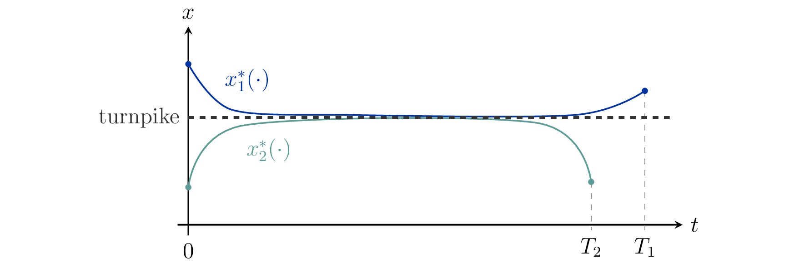
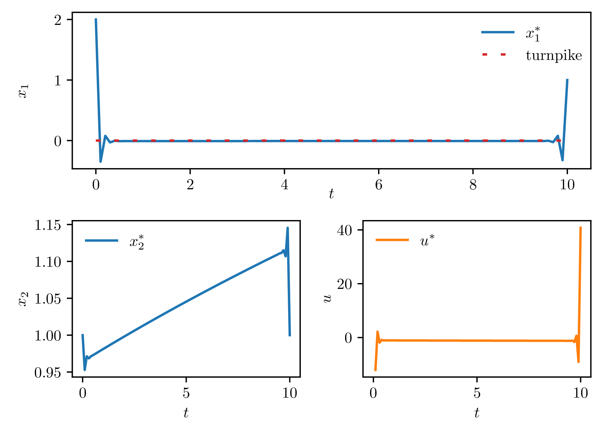

# structured optimal control of gas networks using port-hamiltonian systems
 
## general ideas and areas of application
the general goal of applied mathematics is to use an abstract framework to draw conclusions about reality.
in order to do this, accurate mathematical models need to be chosen.
an approach that has been very useful in the past is to use **dynamical systems**.
these systems can be used to model a wide range of phenomena, ranging from epidemic modeling over moonlandings to power grids and gas infrastructure.
we can simulate a dynamical system using computers, which gives us information about the future evolution of the real-world phenomenon we are modeling.
in the context of a gas pipe, we can learn about the density and the velocity of the gas at a given timepoint, which in turn allows us to compute other important quantities, such as the pressure.
this is very useful data to have for practicioners, as they can use this information to optimize their operations.
in the long run, this helps to save resources and to counteract climate change.
and it is this optimization where our story begins!

to make the mathematical models more accurate, we aim for dynamical systems that have a specific structure.
in the past, physical laws behind the phenomena have often been neglected.
one example is the principle of energy conservation, which states that energy can not be created.
as all real-world phenomena follow this law, models that aim for high accuracy should incorporate this principle.
one approach to achieve this is by modeling with **port-hamiltonian** systems.
these systems are a special class of dynamical systems that stem from energy-based modeling.
this means that the dynamical system is decomposed into parts that 

- store energy,
- distribute energy, and
- dissipate energy.

here, energy dissipation means that energy is converted in such a way that it becomes unusable in practice, such as, e.g., wasted heat.
we can illustrate this modeling viewpoint using the example of a car.
for a car, the energy storing element is the tank, which stores chemical energy in the form of gasoline.
in the motor of the car, controlled explosions burn gasoline to turn the chemical energy into kinetic energy.
this corresponds to distributing energy throughout the system.
however, as we all know, explosions also generate heat.
for a car, this heat energy goes to waste since it can no longer be used to drive the car forward.
this corresponds to energy dissipation.

now, having found the appropriate modeling framework for our task, we can focus on another key aspect of dynamical systems: the **control**.
many dynamical systems can be controlled.
for the example of the car, the gas pedal acts as the control, since it determines how much gasoline is put in the motor, which in turn influences the speed of the car.
since we want to be as efficient as possible, we are interested in **optimal controls**, i.e., controls that minimize a given cost.
for optimal controls, the following question arise.

- can we say something about the behaviour of optimal controls and the associated dynamics?
- how can we efficiently calculate optimal controls in practice?

regarding the first question, let us imagine that we are driving in a car and want to reach our destination in minimal time.
if the travelled distance is long enough, then a detour via a highway will be faster than the more direct path on slower streets.
interestingly, this phenomenon is more or less independent of our starting point and destination.
hence, the optimal path has a very special behaviour.
as it turns out, similar observations can be made for a large class of dynamical systems, see, e.g., [5,12].
for port-hamiltonian system specifically, the cost functional of interest is the **supplied energy** to the system, since this cost functional is the best fit for the energy-based modeling framework of port-hamiltonian systems.

to address the second question, a common scheme are **closed-loop** controls, in which the control is calculated based upon a measured quantity of the system, for example the velocity of the car.
standard techniques for this approach do not give us control laws that can be realized by port-hamiltonian systems.
this is not ideal since this means that we fall out of our modeling framework.
hence, we are interested in the construction of **structured controllers**, i.e., controllers that have a port-hamiltonian structure.
the interconnection with the original system is achieved by using an observed variable as a reference measurement, calculating a control based on this measurement, and feeding this control back to the original system.

  
  <figcaption style="text-align: center;">feedback interconnection of a dynamical system and a controller</figcaption>

  

## mathematical formulation and techniques
to study the behaviour of optimal controls, we investigate **turnpike phenomena** as studied in, e.g., [6,8,10,11].

  
  <figcaption style="text-align: center;">the turnpike phenomenon visualized</figcaption>

 

specifically, we are interested in studying the solutions to the optimal control problem 

$$
        \min_{u \in \mathcal{U}_{\text{ad}}}~C(u) := \int_{0}^{T} y^{\mathsf{T}} u\,\mathrm{d}t
$$

subject to the dynamics

$$
\begin{aligned}
        E(x) \dot{x} & = (J(x) - R(x))\eta(x) + B(x) u, \\
        y & = B(x)^{\mathsf{T}} \eta(x)
\end{aligned}
$$

and $$x(0) = x_0,~ x(T) = x_T$$.
optimal control problems of this form have been studied for linear dynamics in [10] and [11].
the nonlinearities of the system dynamics in our setting make this problem more challenging.
to study this problem, our goal is to make use of the special structure of port-hamiltonian systems and techniques developed in [6] and [8].
these techniques relate the turnpike property to a **dissipativity notion** similar to the one developed by jan willems in the 1970s [13].

regarding the study structured controllers, methods for linear systems have been proposed in [2] and [3].
these methods rely on modifications of algebraic riccati equations, which are matrix equations of the form 

$$
F^{\mathsf{T}} X + X F + X G X + Q = 0.
$$

for linear systems, special solutions of such matrix equations define the optimal control.
in [2] and [3], these equations were modified in a specific way that ensured that the corresponding controller could be formulated as a port-hamiltonian system.
we plan to investigate this problem also for nonlinear system.
for nonlinear systems, the algebraic riccati equation is replaced by the **hamilton-jacobi-bellman equation** [1], which is a partial differential equation.
this equation involves the value function of the optimal control problem, which is a function that maps initial data for the dynamical system to the optimal value of the cost functional for that data.

  
## results and future research
in the preprint [9] we have shown that, under smoothness assumptions on the system dynamics, the optimal control problem (1) admits a turnpike.
the turnpike is given by a smooth submanifold of $$\mathbb{R}^n$$ that is associated with the energy-dissipating part of the system dynamics, namely 

$$
\mathcal{M} = \{ x\in\mathbb{R}^n ~|~ R(x)^{1/2} \eta(x) = 0\}.
$$

in the figure below, numerical results for an academic system are shown.

  
  <figcaption style="text-align: center;">optimal control and associated trajectories for an academic system</figcaption>

 

future research topics include the study of more complicated systems, such as gas system studied in [4].
due to their nonlinear behaviour, numerically computing an optimal control for such systems is difficult.
certain properties of the considered optimal control problem, such as singularities [7], further increase the difficulty.
  
## references

[1] m. bardi and i. capuzzo-dolcetta, optimal control and viscosity solutions of hamilton-jacobi-bellman equations, birkhäuser, boston, ma, u., 1997.

[2] t. breiten and a. karsai, structure-preserving h∞ control for port-hamiltonian systems, systems & control letters, 174 (2023), p. 105493.

[3] t. breiten, r. morandin, and p. schulze, error bounds for port-hamiltonian model and controller reduction based on system balancing, computers & mathematics with applications, 116 (2022), pp. 100–115.

[4] p. domschke, b. hiller, j. lang, v. mehrmann, r. morandin, and c. tischendorf, gas network modeling: an overview. 2021.

[5] r. dorfman, p. samuelson, and r. solow, linear programming and economic analysis, dover books on advanced mathematics, dover publications, 1987.

[6] t. faulwasser, k. flaßkamp, s. ober-blöbaum, m. schaller, and k. worthmann, manifold turnpikes, trims, and symmetries, mathematics of control, signals, and systems, 34 (2022), pp. 759–788.

[7] t. faulwasser, j. kirchhoff, v. mehrmann, f. philipp, m. schaller, and k. worthmann, hidden regularity in singular optimal control of port-hamiltonian systems, arxiv preprint 2305.03790, 2023.

[8] l. grüne and r. guglielmi, on the relation between turnpike properties and dissipativity for continuous time linear quadratic optimal control problems, mathematical control & related fields, 11 (2021), pp. 169–188.

[9] a. karsai, manifold turnpikes of nonlinear port-hamiltonian descriptor systems under minimal energy supply, arxiv preprint 2301.09094, 2023.

[10] f. philipp, m. schaller, t. faulwasser, b. maschke, and k. worthmann, minimizing the energy supply of infinite-dimensional linear port-hamiltonian systems, ifac-papersonline, 54 (2021), pp. 155–160.

[11] m. schaller, f. philipp, t. faulwasser, k. worthmann, and b. maschke, control of port-hamiltonian systems with minimal energy supply, european journal of control, 62 (2021), pp. 33–40.

[12] e. trélat and e. zuazua, the turnpike property in finite-dimensional nonlinear optimal control, journal of differential equations, 258 (2015), pp. 81– 114.

[13] j. willems, dissipative dynamical systems part i: general theory, archive for rational mechanics and analysis, 45 (1972), pp. 321–351.

  
## collaborators
attila karsai, tobias breiten

## time horizon
01.07.2022 - 30.06.2026

## financing
subproject [b03](https://gepris.dfg.de/gepris/projekt/259091447) of the [trr154](https://gepris.dfg.de/gepris/projekt/239904186?language=en)

  

[go back](../)